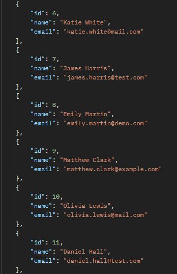
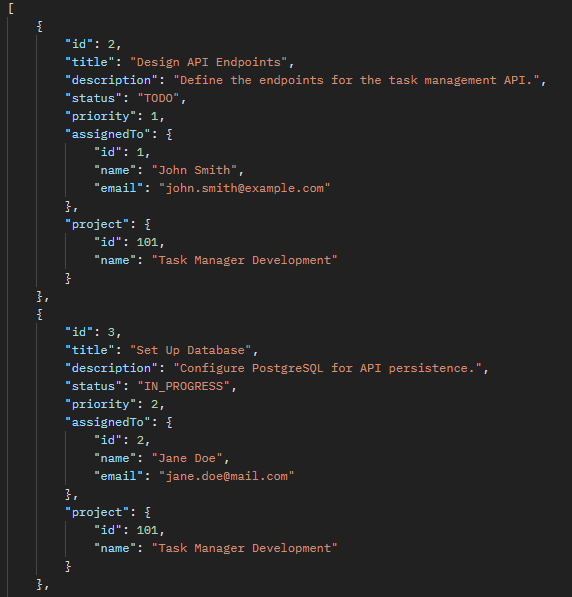
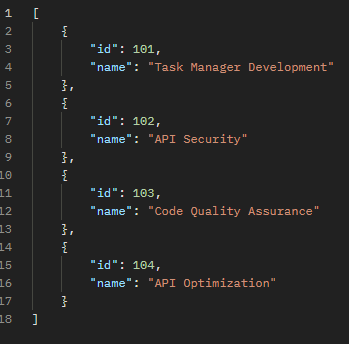

<h1 align="center">
Task Manager API</h1>

## 📚 Project
The Task Manager API is a backend application designed to manage tasks efficiently. It provides a robust and scalable solution for creating, updating, retrieving, and deleting tasks. Built with Java, Spring, this API supports RESTful operations and follows best practices for API development.

## 🔍 Operation Flows

### Find (GET Method):
Purpose: Retrieve data from the database based on specific criteria or fetch all data. <br> <br>
<strong>Users:</strong> Retrieve all users: ```GET /users``` <br>
<strong>Tasks:</strong> Retrieve all tasks:``` GET /tasks``` <br>
<strong>Projects:</strong> Retrieve all projects: GET ```/projects```<br>

### Create (POST Method)
Purpose: Add new data to the database. <br> <br>
<strong>Users:</strong> Create a new user: ```POST /users``` <br>
<strong>Tasks:</strong> Create a new task: ```POST /tasks``` <br>
<strong>Projects:</strong>Create a new project: ```POST /projects``` <br>

### Modify (PUT Method)
Purpose: Update existing data in the database. <br> <br>
<strong>Users:</strong>Update a user’s details: ```PUT /users/:id```<br>
<strong>Tasks:</strong>Update a task’s status or details: ```PUT /tasks/:id```<br>
<strong>Projects:</strong>Update project details: ```PUT /projects/:id```

### Delete (DELETE Method)
Purpose: Remove data from the database. <br> <br>
<strong>Users:</strong>Delete a user by ID: ```DELETE /users/:id``` <br>
<strong>Tasks: </strong>Delete a task by ID: ```DELETE /tasks/:id``` <br>
<strong>Projects:</strong> Delete a project by ID: ```DELETE /projects/:id``` 

## 👨‍💻 Endpoints

<details>
<summary><b>Users</b></summary>

</details>

<details>
<summary><b>Task</b></summary>

</details>

<details>
<summary><b>Projects</b></summary>

</details>

## 💻 Technology

- Language: Java
- Framework: Spring
- Database: PostgreSQL
- Maven
- JUnit5
- Mockito
- Prometheus & Grafana
- AWS (In progress)

## 👨‍💻 Dev
Yan Carlos <br> <br>
[](https://www.linkedin.com/in/yan-carlos-00a740251/)
